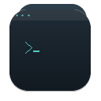

# Terminal Fly

A macOS terminal that floats above every other window. Press one hotkey, it
appears over Figma — or your editor, or the browser — and stays there while you
work. Press it again, it's gone.

Built because the Hammerspoon + kitty workaround kept fighting the window
manager. Owning the window means we can just set the level and be done.



## Status

Early but working. Steps 1–6 of the plan are complete and verified; see
[Testing](#testing) for the actual numbers.

| Step | Feature | State |
|------|---------|-------|
| 1 | Floating `NSPanel` | ✅ |
| 2 | SwiftTerm terminal + login shell | ✅ |
| 3 | Global hotkeys | ✅ |
| 4 | Corner presets, save/restore, multi-display | ✅ |
| 5 | Settings UI (appearance, hotkeys, shell) | ✅ |
| 6 | Menu bar item + quick actions | ✅ |
| 7 | Icon, DMG | ✅ (notarization pending a Developer ID) |
| 8 | herdr integration | ✅ |

## Install

No prebuilt binary yet — build from source:

```bash
git clone https://github.com/dickyudhandika/terminal-fly.git
cd terminal-fly
./scripts/build.sh release
open build/TerminalFly.app
```

**Requires macOS 14+ and the Xcode Command Line Tools.** Xcode.app is *not*
needed — see [Building](#building) for why that's worth stating explicitly.

## Usage

| Shortcut | Action |
|----------|--------|
| `⌃⌥P` | Show/hide the panel |
| `⌃⌥C` | Cycle corner position |
| `⌃⌥↑` | Shrink height (top edge pinned) |
| `⌃⌥↓` | Grow height (top edge pinned) |
| `⌃⌥←` | Shrink width (margin-anchored edge pinned) |
| `⌃⌥→` | Grow width (margin-anchored edge pinned) |

All six are rebindable in Settings → Hotkeys.

Resize is bounded by the display: `NSWindow.maxSize` / `minSize` are set from the
current screen's `visibleFrame` (minus a 24pt margin), so neither a hotkey nor a
mouse drag can take the panel past the menu bar, the Dock, or the screen edge.
Growth is also pulled back *onto* the screen: a small panel parked low, then
grown to full height, would otherwise end up legal in size and hanging off the
bottom edge. The limits are recomputed when the panel changes screen.

Click the panel to type. Click anywhere else and focus returns to that app — the
panel stays visible, it just stops taking keystrokes. That's the whole interaction
model: no modes, no "enter floating mode" step.

**⚠️ If the hotkeys do nothing:** another app has almost certainly claimed the
combo. Carbon's `RegisterEventHotKey` reports success even when it loses.
Hammerspoon is the usual culprit — check `~/.hammerspoon/` for stale scripts that
bind the same keys. See [Hotkeys don't fire](#hotkeys-dont-fire).

### herdr mode

If [herdr](https://herdr.dev) is running, the menu bar grows a **Follow herdr
pane** submenu listing its panes (agent, status, and title included). Pick one and
the panel shows that pane instead of a local shell — read it, type into it, and
leave with **Leave herdr mode**. Standalone mode is the default and the fallback:
if herdr isn't running, or dies mid-session, the panel drops back to its own
shell rather than freezing.

Notes from building against herdr 0.8.2:

- The socket is `~/.config/herdr/herdr.sock`, newline-delimited JSON. Override the
  path with `HERDR_SOCKET` (useful for a non-standard config dir).
- herdr closes the connection after **every** response — one request per
  connection. Only `events.subscribe` stays open, and it serves no requests.
- There is no output-streaming event, so the panel **polls** `pane.read` at 0.4 s
  and repaints only when the visible text changes. Subscribable events are
  metadata only (`pane.updated` covers title/cwd/focus/status, not output).
- Input goes through `pane.send_input` (raw bytes) and `pane.send_keys`
  (named keys like `Enter`).

## Building

This project builds with **Command Line Tools only**. That's deliberate, and it
cost some effort to arrange:

- `xcodebuild` is unavailable without Xcode.app.
- SwiftPM is *broken* on a CLT-only machine — the bundled
  `libPackageDescription.dylib` is missing symbols, so every `Package.swift`
  fails to link with `Undefined symbols: PackageDescription.Package.__allocating_init`.

So `scripts/build.sh` compiles SwiftTerm and the app sources directly with
`swiftc`, generates the SwiftTerm build-info sources by running its SPM plugin
binary manually, and assembles the bundle by hand. Same sources, same result, no
Xcode.

```bash
./scripts/verify.sh            # build + assert binary/bundle + --test + --selftest
./scripts/build.sh debug       # fast iteration
./scripts/build.sh release     # optimised
./scripts/make-icon.py         # regenerate the icon (needs Pillow)
./scripts/make-dmg.sh          # package a DMG
./scripts/make-dmg.sh --notarize   # + notarize (needs credentials)
```

Use `verify.sh` rather than piping `build.sh` into `tail` — a pipeline returns
the last command's status, so a failed build would still look like it succeeded.

### Dependency pin

SwiftTerm is a submodule pinned to the **v1.20.0 release tag**, not `main`. The
releases are the API surface this app is written against; tip-of-main uses
`Span` (Swift 6.2+) and other unreleased types, which fails to compile on older
toolchains and would make the project build only for people on the newest Xcode.

## Testing

There is no XCTest harness, because there's no Xcode. Tests are built into the
binary behind flags:

```bash
./build/TerminalFly.app/Contents/MacOS/TerminalFly --test        # pure logic, no window server
./build/TerminalFly.app/Contents/MacOS/TerminalFly --uitest      # real window server
./build/TerminalFly.app/Contents/MacOS/TerminalFly --selftest    # spawns a real PTY
./build/TerminalFly.app/Contents/MacOS/TerminalFly --herdr-test  # live herdr socket
./build/TerminalFly.app/Contents/MacOS/TerminalFly --herdr-uitest # herdr render path, real window
./build/TerminalFly.app/Contents/MacOS/TerminalFly --logintest    # login item (needs /Applications)
```

`--test` and `--selftest` run headlessly, so they work over SSH and in CI.
`--uitest` needs a logged-in GUI session. The two herdr flags need herdr running
and exit **2** (skip) rather than 1 when it isn't — absence is a supported state,
not a failure.

Current state:

```
--test        PASS: 192 checks, 0 failures
--uitest      PASS: 53 checks, 0 failures
--selftest    PASS
--herdr-test  PASS (3 sequential requests, each on its own connection)
--herdr-uitest PASS (render + input + fallback, in a real window)
```

`--herdr-uitest` creates its own scratch herdr workspace, so it never touches the
panes you're working in.

CI runs on every push: `build` and `clt-only` both build in release and run
`--test`, where `clt-only` switches `xcode-select` to CommandLineTools first and
asserts Xcode is *not* selected. So the CLT-only claim above is machine-checked,
not just true on the author's laptop.

Geometry is deliberately kept in a pure, AppKit-free type (`PanelGeometry`) so
corner maths is testable without a window server. `PositionManager` is the thin
AppKit shell around it.

## Architecture

```
TerminalFlyApp          @main, NSApplicationDelegate
└─ AppCoordinator       wires everything, owns preferences
   ├─ PanelController   the NSPanel (level = .floating)
   │  ├─ TerminalSurface  SwiftTerm subclass
   │  ├─ PositionManager  corner presets + persistence
   │  └─ PanelDelegate    save-on-move
   ├─ HotkeyManager     Carbon RegisterEventHotKey
   ├─ MenuBarController NSStatusItem
   └─ SettingsWindow    SwiftUI settings scene
```

Two notes for anyone touching the window code:

- **`canBecomeKey = true` on a `.nonactivatingPanel`** is what lets you click to
  type without the app stealing focus. Both halves are required.
- **`terminalDelegate` is taken.** `LocalProcessTerminalView` declares it, and you
  can't override a non-`open` property from another module. Our delegate lives on
  `hostDelegate` and is assigned into `processDelegate`.

## Troubleshooting

### Hotkeys don't fire

Carbon's `RegisterEventHotKey` **returns success even when the combo is already
taken.** Whoever registered first — usually a login item that starts before you —
silently wins and your handler is never called. There is no error to inspect.

Debug it in this order:

1. **Check for another owner.** Hammerspoon is the usual culprit and hides its
   bindings in separate files:
   ```bash
   grep -rn "hs.hotkey.bind" ~/.hammerspoon/
   ps aux | grep -iE "hammerspoon|raycast|karabiner|bettertouch|skhd" | grep -v grep
   ```
2. **Quit the suspect entirely** (not just reload its config) and try again:
   ```bash
   osascript -e 'quit app "Hammerspoon"'
   ```
   If the hotkey now works, the conflict was external. Fix the other app's config.
3. **Rule out your own code** by trying a combo nothing else uses. If ctrl+alt+J
   fires but ctrl+alt+P doesn't, it's a conflict on that one combo — not your
   registration code.

Also make sure only one copy is running; a stale instance breaks registration
silently:

```bash
pkill -9 -f TerminalFly && pgrep -fl TerminalFly   # expect no output
```

### Panel doesn't appear

Check the menu bar item is there (it's an accessory app, so there's no Dock icon
and no window in ⌘-Tab). If the panel is off-screen — e.g. it was last used on a
display you've since unplugged — it re-parks on the primary screen
automatically; if that fails, delete the saved frame:

```bash
defaults delete com.terminalfly.app panelFrame
```

## Design decisions

**Why an NSPanel and not a plain window** — `NSPanel` refuses main-window status,
which is exactly right for an overlay, and takes `.nonactivatingPanel` so it can
accept keystrokes without becoming the active app.

**Why no App Store** — the sandbox blocks the PTY fork a terminal needs. Direct
distribution only. Open source, MIT.

**Why `-l` on the shell** — launched from Finder, the app inherits almost no
environment. A login shell sources `.zprofile`/`.zshrc` and finds the user's real
PATH. Standard terminal-app gotcha, fixed at the source.

## Known gaps

- **Notarization/DMG signing needs an Apple Developer ID** — the tooling is in
  place (`--notarize`) but no certificate is available yet. The DMG is ad-hoc
  signed for now, so other machines will need a Gatekeeper override.
- **Multi-display re-parking** is verified by unit test (a saved frame on a
  vanished screen is rejected) but not on real hardware — single-display machine.
- **Launch at login** is implemented and verified with `--logintest`, which
  registers a login item, checks the status, and unregisters it again. It only
  works when the app is in a stable location (`/Applications`), because that is a
  `SMAppService` requirement — running from `build/` reports a skip, not a failure.
- **Sparkle auto-update is not implemented** (deliberate). It is a P2 nice-to-have
  and requires a notarized app plus an EdDSA-signed appcast on a hosted feed;
  against the current ad-hoc-signed DMG it would be theatre. It lands with the
  Developer ID work.
- **herdr integration** (Step 8) polls `pane.read` rather than subscribing to
  events: herdr 0.8.2 exposes no output-streaming event, so pane changes are
  detected by comparing successive screen snapshots (repaint only on change).

## License

MIT — see [LICENSE](LICENSE).
